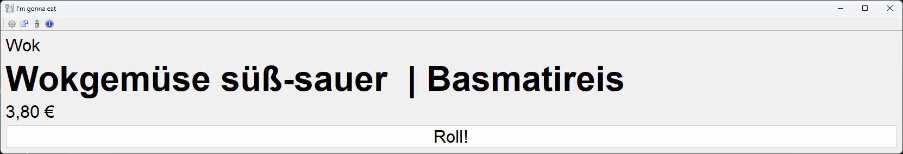
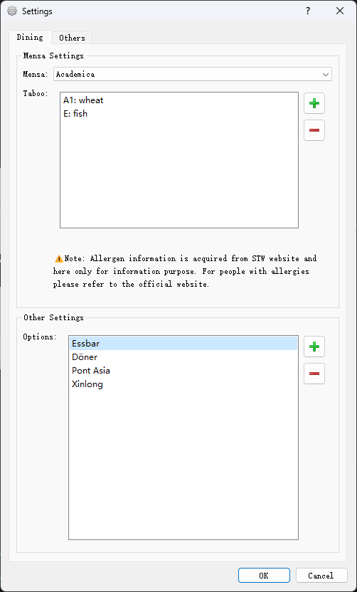
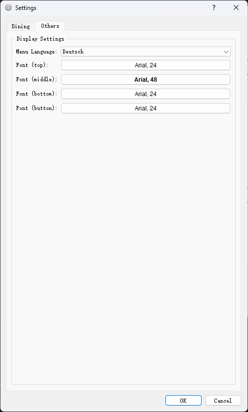

# RWTH - What to eat
## Introduction
Hard to decide what to eat in the mensa? Click the button and go for it!


This program is based on PyQt5. It downloads the menu of mensa from STW website and randomly picks a dish for you! 

## Dependencies
```
PyQt5, requests, beautifulsoup4, pyyaml
```

## Usage - Settings
In the latest version, you may set your preferences using the Settings menu.
### Dining Option Settings

In this panel, you may select which mensa you would like to dine in. You may also set a taboo list for those ingredients that you wish not to eat, according to the contents information given by the STW website.

Besides dining options in mensa, you may also add your favorite restaurants or food into the list.



### Other Settings

In this panel, you may select the language to display the menu. You may also customize the appearance of the widgets in the main window.



## About
All the online data are acquired from and belonging to Studierendenwerk Aachen. 

